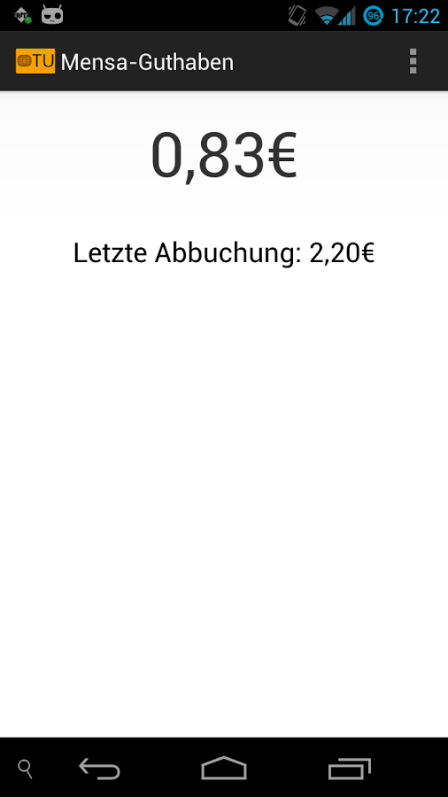

{:width="300px"}

Working Universities
====================

The App has been successfully tested on cards used at various universities:

* Uni Bamberg
* Uni Bayreuth (only Print-/Copy-balance visible)
* Uni Bielefeld (only newer cards)
* Uni Bochum (only newer cards)
* FH Brandenburg
* TU Braunschweig
* Uni Bremen
* HS Bremerhaven
* TU Clausthal
* TU Darmstadt
* h_da Darmstadt
* TU Dresden Emeal
* HS Freiburg
* DH Gera Eisenbach
* Uni Greifswald
* MLU Halle
* HAW Hamburg
* HS Hannover
* Uni Heidelberg
* Uni Hohenheim (only newer cards)
* TU Ilmenau
* HS Koblenz
* Uni Koblenz
* FH Köln
* Uni Kiel (CAU-Card)
* Uni Köln
* Uni Leipzig
* Uni Lüneburg
* Uni Magdeburg
* DHBW Mosbach
* HS Offenburg
* Uni Osnabrück
* HS Osnabrück
* Uni Saarland
* Uni Stuttgart
* FH Würzburg
* Uni Würzburg
* HS Zittau/Görlitz

[You can help to support your university as well](otherUnis.md)
